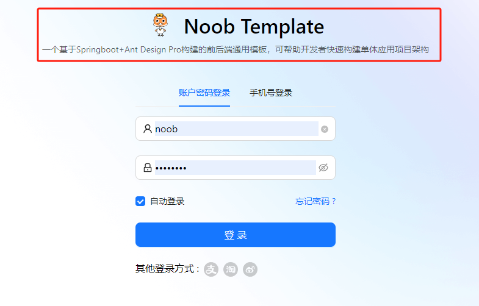
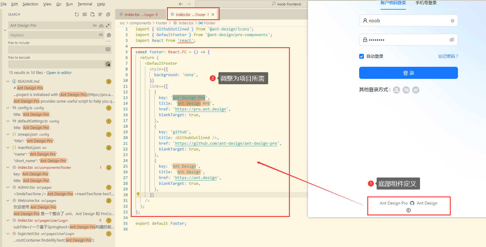
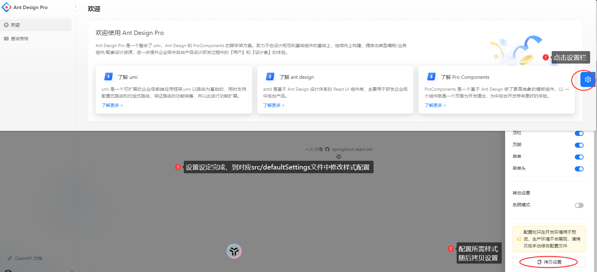
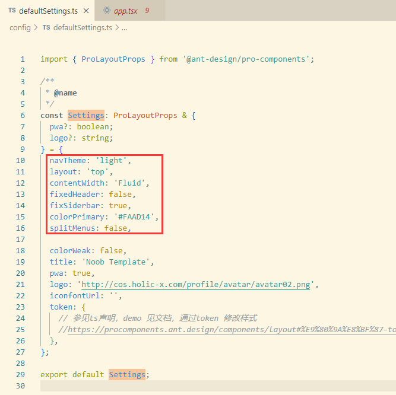
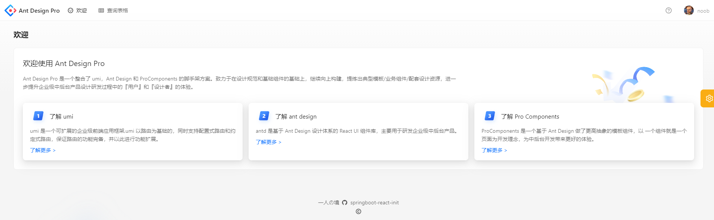
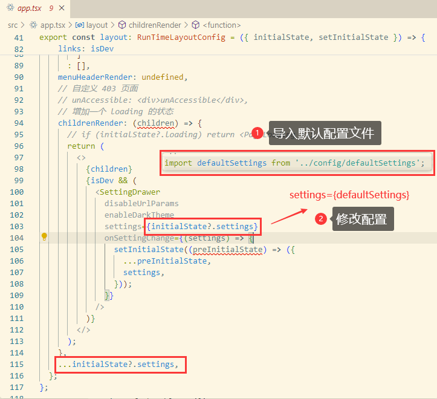
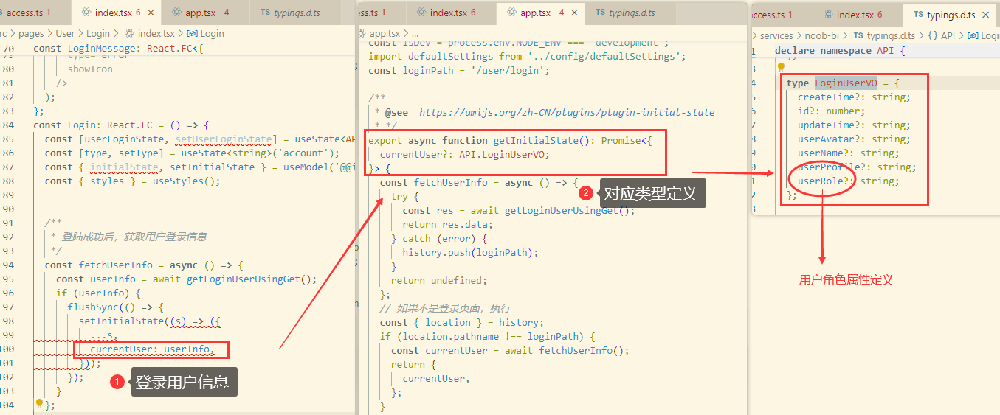
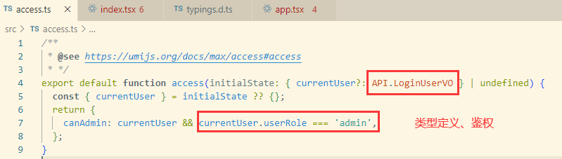
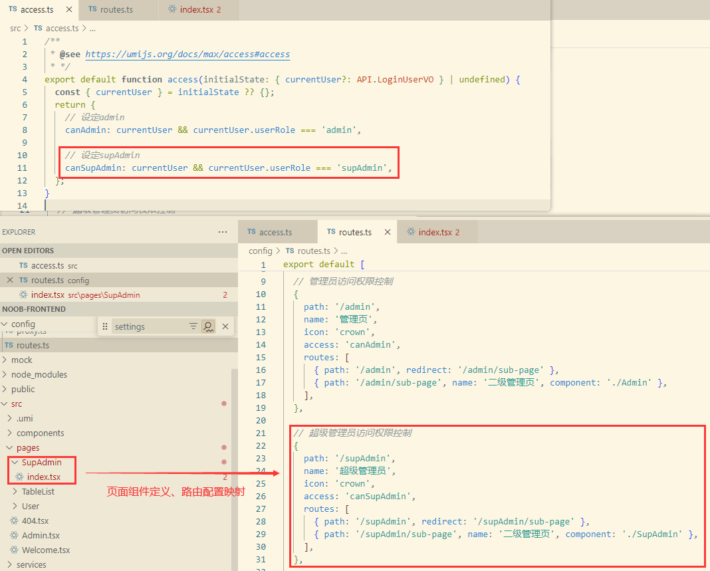

# 脚手架构建


## 前端脚手架构建

### 1.项目初始化

构建前端项目，搭建基于react的ant design pro项目脚手架，注意项目版本依赖问题（如果nodejs版本不兼容则适当调整即可）

```powershell
# 使用 npm 加载脚手架
npm i @ant-design/pro-cli -g
# 创建前端项目
pro create noob-frontend

# 选择umi版本（可以尝试umi4踩新坑,umi3提示选择简单还是全量脚手架），原使用umi3 simple

# 进入指定项目安装项目依赖
cd noob-frontend
tyarn 或者 npm install

# 脚手架初始完成，进入开发状态
npm run start

# 项目启动完成访问http://localhost:8000/,第一次初始化加载会比较慢

```

​	查看package.json文件，对照相应的启动命令看其配置，如果执行`npm run dev`命令本质上执行的是`start：dev`，可以看其指令配置中MOCK=none，由于此时还没有接入后台数据接口，因此需要借助MOCK模拟数据接口实现访问。重启项目`npm run start`访问，然后登录访问主页（start以模拟数据方式运行，dev命令禁用了MOCK调用自己定义的后端）

​	项目构建完成，引入git仓库做版本管理


### 2.项目瘦身

 框架本身生成的东西有很多，但实际上一些小型项目中不需要引用这么复杂的内容，为了优化代码结构，此处通过清理项目一些可能不会用到的东西给项目瘦身

#### （1）国际化移除：/src/locales

​	国际化：集成了多种语言：中文、英文... ，考虑项目主要在国内访问，去除国际化配置；如果要使用国际化，还要去配置不同语言的引用

​	在package.json文件中找到`i18n-remove`，这里提供了移除国际化的脚本（ "i18n-remove": "pro i18n-remove --locale=zh-CN --write",），执行指令（如果指令执行失败，参考[官方解决方案](https://github.com/ant-design/ant-design-pro/issues/10452)）

```shell
pro i18n-remove --locale=zh-CN --write

# 指令执行出错，参考官方解决方案，此处参考引入依赖后再次尝试
yarn add eslint-config-prettier
yarn add eslint-plugin-unicorn

或者执行：yarn add eslint-config-prettier --dev yarn add eslint-plugin-unicorn --dev 

修改：
node_modules/@umijs/lint/dist/config/eslint/index.js
// es2022: true
```

​	奇奇怪怪的问题：在vscode中执行指令报错，但是通过cmd窗口执行指令正常（指令执行完毕移除了一些关联配置）


​	指令执行是为了移除国际化相关配置文件，需要**手动移除locales文件夹**，完成清理后重启项目检查是否正常运行

​	重启项目如果报错则进一步排查（例如移除国际化出现SyntaxError: Export 'SelectLang' is not defined，参考[官方解决方案](https://github.com/ant-design/ant-design-pro/issues/11143)：将src/components/index.js 中的 SelectLang 变量删除）


> 常见问题处理：左侧菜单栏不显示

​	需要修改路由配置，给config/route.ts中配置的路由都加上name属性（随后重启项目尝试访问）

### 3.前端模板优化

#### 🚀项目结构梳理

了解项目结构和内容，把一些不需要用到的东西清理掉


| 项目结构                                                     | 说明（❌表示可删除）                                          |
| ------------------------------------------------------------ | ------------------------------------------------------------ |
| .husky                                                       | 检查提交的代码，是否规范（代码检验的小工具）                 |
| config                                                       | umi配置（包括路由、构建等配置）                              |
| config.ts                                                    | Ant Design Pro核心配置（整个项目所用框架配置）               |
| defaultSetting.ts                                            | Ant Design Pro默认配置                                       |
| opeapi.json                                                  | 示例数据（❌）                                                |
| proxy.ts                                                     | 代理（便于本地开发）                                         |
| router.ts                                                    | 定义网页路由（输入网址跳转页面）                             |
| mock                                                         | 本地模拟数据（❌）                                            |
| public/icons                                                 | icons目录存放页面图标（❌）可以引入自定义图标                 |
| src/.umi                                                     | 框架自动生成的隐藏文件（可不管）                             |
| src/components                                               | 业务通用组件                                                 |
| src/locales                                                  | 国际化资源（❌）搭配去除国际化指令删除                        |
| src/pages                                                    | 业务页面入口和常用模板                                       |
| src/service                                                  | 后台接口服务                                                 |
| access.ts                                                    | 控制页面访问权限                                             |
| app.tsx                                                      | Ant Design Pro框架的主要文件                                 |
| global.less                                                  | 全局样式                                                     |
| global.tsx                                                   | 全局JS                                                       |
| manifest.json                                                | 开发app或者h5网页指定多种不同配置（此处可❌）<br />例如：生成项目名称、项目图标尺寸等（打包的时候用到） |
| requestErrorConfig.js                                        | 控制前端页面发送请求的配置                                   |
| service-worker.js                                            | h5网页离线时优化页面的体验                                   |
| tests                                                        | 测试工具（❌）                                                |
| types                                                        | ❌                                                            |
| .editorconfig<br />.eslintignore<br />.eslintrc.js<br />.prettierignore<br />.prettierrc.js | 保证前端项目代码规范                                         |
| jest.config.ts                                               | 单元测试框架                                                 |
| jsconfig.json                                                | 控制语法                                                     |
| README.md                                                    | 项目默认文档                                                 |


#### 🚀图标替换

> 图标替换：[iconfont](https://www.iconfont.cn/activity/entries/all?activity_id=1)

public目录：（svg下载）logo.svg替换、（png下载）favicon.ico替换


> 标题替换

​	【ctrl+shift+F】将原有Ant Design Pro相关的内容替换为项目相关


#### 🚀项目文本替换

​	将原有框架的一些默认预设文本调整为自身项目所需（可以通过前端页面全局搜索替换，也可对应到文件中精准替换）

##### （1）登录页面

​	文件：`src/pages/User/Login/index.tsx`，修改登录页面组件内容

​	


##### （2）系统主页（默认欢迎页）

文件：`src/pages/Welcome.tsx`


##### （3）底部栏定义

文件：`src/components/Footer/index.tsx`




#### 🚀样式替换

​	脚手架提供的页面上的样式更换按钮可以自己选择，点击设置样式，选择自己喜欢的样式配置进行更改，选择完成【拷贝样式】

​	文件：`config/defaultSettings`




【1】拿到自定义配置，修改：config/defaultSettings默认内容

```tsx
// 原defaultSettings默认内容
import { ProLayoutProps } from '@ant-design/pro-components';

/**
 * @name
 */
const Settings: ProLayoutProps & {
  pwa?: boolean;
  logo?: string;
} = {
  navTheme: 'light',
  // 拂晓蓝
  colorPrimary: '#1890ff',
  layout: 'mix',
  contentWidth: 'Fluid',
  fixedHeader: false,
  fixSiderbar: true,
  colorWeak: false,
  title: 'Ant Design Pro',
  pwa: true,
  logo: 'https://gw.alipayobjects.com/zos/rmsportal/KDpgvguMpGfqaHPjicRK.svg',
  iconfontUrl: '',
  token: {
    // 参见ts声明，demo 见文档，通过token 修改样式
    //https://procomponents.ant.design/components/layout#%E9%80%9A%E8%BF%87-token-%E4%BF%AE%E6%94%B9%E6%A0%B7%E5%BC%8F
  },
};

export default Settings;

```

```json
# 参考拷贝配置
{
  "navTheme": "light",
  "layout": "top",
  "contentWidth": "Fluid",
  "fixedHeader": false,
  "fixSiderbar": true,
  "colorPrimary": "#FAAD14",
  "splitMenus": false
}
```



【2】修改app.tsx文件

```tsx
import defaultSettings from '../config/defaultSettings';
settings={defaultSettings}
```






#### 🚀请求拦截和响应拦截

​	文件：`src/requestConfig.ts`

> 默认定义

```ts
  // 请求拦截器
  requestInterceptors: [
    (config: RequestOptions) => {
      // 拦截请求配置，进行个性化处理。
      // const url = config?.url?.concat('?token = 123');
      // return { ...config, url };
      return config;
    },
  ],

  // 响应拦截器
  responseInterceptors: [
    (response) => {
      // 拦截响应数据，进行个性化处理
      const { data } = response as unknown as ResponseStructure;

      if (data?.success === false) {
        message.error('请求失败！');
      }
      return response;
    },
  ],
```

> 结合后端响应调整请求拦截和响应拦截定义

```ts
// 请求拦截器
  requestInterceptors: [
    (config: RequestOptions) => {
      // 拦截请求配置，进行个性化处理。
      // const url = config?.url?.concat('?token = 123');
      // return { ...config, url };
      return config;
    },
  ],

  // 响应拦截器
  responseInterceptors: [
    (response) => {
      // 拦截响应数据，进行个性化处理
      const { data } = response as unknown as ResponseStructure;
      // 打印响应数据用于调试
      console.log('data', data);
      // 当响应的状态码不为0，抛出错误
      if (data.code !== 0) {
        throw new Error(data.message);
        // message.error('请联系管理员处理');
      }
      // 如果一切正常，返回原始的响应数据
      return response;
    },
  ],
```


## 前后端联调


> OpenAPI

​	使用Ant Design Pro自带的openAPI工具，根据后端swagger接口文档，自动生成对应请求的service代码

​	前端项目配置：config/config.ts配置openAPI参数：schemaPath（后端接口文档）、projectName（项目名称）

```tsx
openAPI: [
    {
      requestLibPath: "import { request } from '@umijs/max'",
      // 或者使用在线的版本
      schemaPath: "http://localhost:8101/api/v2/api-docs",
      projectName:"noob-template",
      // schemaPath: join(__dirname, 'oneapi.json'),
      mock: false,
    }
  ],
```

​	打开package.json，执行openapi指令，生成swagger文件（在services目录多出一个`noob-template`目录（和上面你定义的projectName对应），里面自动生成调用后端指定接口的方法代码）（终端输入`yarn run openapi`）


### 1.登录模块


> 无用代码清理

​	删除pages/User/Login下的`_snapshots_/login.test.tsx.snap`

​	pages/User/Login/index.tsx文件中的`<Lang />`飘红，没有用到直接删除（Lang配置相关）


​	删除自动登录、其他登录方式、手机号登录登相关代码


​	忘记密码？调整为注册（实现注册接口）


​	调整完成页面参考如下所示


> 登录功能实现

​	关注`<LoginForm>`组件实现，将用户输入的内容（key）替换为后端对应的内容即可（查看登录接口请求参数即可）

​	name =》userAccount、password=》userPassword

​	可修改placeholder属性（输入提示）


​	删除错误填写验证相关


> 后端接口对接

定位onFinish=》当用户点击登录后执行handleSubmit方法，将LoginParams调整为后端的


handleSubmit&fetchUserInfo修改：


```tsx
/**
   * 登陆成功后，获取用户登录信息
   */
  const fetchUserInfo = async () => {
    const userInfo = await getLoginUserUsingGet();
    if (userInfo) {
      flushSync(() => {
        setInitialState((s) => ({
          ...s,
          currentUser: userInfo,
        }));
      });
    }
  };

  /*
  useEffect(()=>{
    listChartByPageUsingPost({}).then(res=>{
      console.error('res',res)
    })
  })
  */

  const handleSubmit = async (values: API.UserLoginRequest) => {
    try {
      // 登录
      const res = await userLoginUsingPost(values);
      if (res.code === 0) {
        const defaultLoginSuccessMessage = '登录成功！';
        message.success(defaultLoginSuccessMessage);
        await fetchUserInfo();
        const urlParams = new URL(window.location.href).searchParams;
        history.push(urlParams.get('redirect') || '/');
        // 登陆成功后将登陆用户保存到全局状态中，默认登陆跳转到主页是拿不到登陆用户信息的，需要刷新页面调用获取登陆用户信息的接口
        setInitialState({
          currentUser: res.data
        });
        return;
      } else {
        message.error(res.message);
      }
    } catch (error) {
      const defaultLoginFailureMessage = '登录失败，请重试！';
      console.log(error);
      message.error(defaultLoginFailureMessage);
    }
  };
```

​	如果userName、userAvatar没有显示可以在后台数据库中补充（后续再完善代码细节），完成上述步骤启动登录验证接口是否调通

> 清理未引用的内容

VSCode快捷键（shift+alt+O）


> 全局状态保存（登陆用户信息：此处注意保存的用户信息参数为currentUser）

​	app.tsx文件，找到getInitialState函数修改。然后按【shift+alt+O】清理无用引用


```tsx
export async function getInitialState(): Promise<{
  currentUser?: API.LoginUserVO;
}> {
  const fetchUserInfo = async () => {
    try {
      const res = await getLoginUserUsingGet();
      return res.data;
    } catch (error) {
      history.push(loginPath);
    }
    return undefined;
  };
  // 如果不是登录页面，执行
  const { location } = history;
  if (location.pathname !== loginPath) {
    const currentUser = await fetchUserInfo();
    return {
      currentUser,
    };
  }

  return {};
}
```

> 头像加载

​	登录后访问发现头像转圈圈没有加载进去，数据库中用户对应userAvatar要配置为对应头像链接

​	修改app.tsx的头像配置


​	修改用户名配置：src/compontents/RightContent/AvatarDropdown.tsx（头像下拉框），将name修改为userName


​	此处继续访问发现登录跳转页面后还是无法加载，排查**loading**组件（打印登录用户信息发现没有数据）发现还是没有登录（说明用户登录状态没有保存成功）


需要在app.tsx中配置`withCredentials: true`

```tsx
export const request = {
  baseURL:"http://localhost:8101",
  withCredentials: true,
  ...errorConfig,
};
```


> errConfig配置(requestErrorConfig.ts配置)

​	可以将requestErrorConfig.ts重命名为requestConfig.ts（这个文件中定义了请求处理、请求拦截器、响应拦截器）。（重命名需注意app.tsx的引用也要相应修改）

​	请求拦截器中给所有的请求都加上了token字段，可以将这部分注释掉，这样通过F12查看接口看起来简洁一点


​	清理TableList（前后端联调这部分的内容没有后端接口会报错）：删除page/TableList文件夹，去除路由

#### ❌登录用户全局状态（❌废弃）

​	*在api-platform中自定义用户全局状态内容，此处还是沿用框架的currentUser配置（参考bi-platform前端模板优化实现），此处不做调整，忽略这块内容*

> 用户登录完成，前端从后台加载用户信息后，会将数据保存到全局状态中。默认脚手架提供并未保存到全局状态，所以要进行相应的修改。

（1）修改项目根目录下的`typing.d.ts`文件，定义全局状态类型（InitialState），保存用户状态（当成全局变量）

```ts
/**
 * 全局状态类型定义
 */
interface InitialState{
    // 登录用户信息
    loginUser?:API.UserVO
}
```

（2）修改app.tsx的getInitialState 的方法

​	app.tsx的getInitialState 的方法：每当首次访问页面时，就会被执行用以获取用户信息和当前的全局状态

​	这段代码的实现是，当页面首次加载的时候，获取全局要保存的数据（此处为上面定义的用户登录信息/用户登录状态），随后执行用户信息获取操作（参考下面fetchUserInfo的实现用于获取当前登录用户信息）


​	修改fetchUserInfo方法实现，调用后台接口获取登录用户信息（类似地需要import引入接口方法getLoginUserUsingGet，随后执行）

```ts
// 1.引入获取用户登录信息接口
import { getLoginUserUsingGet } from '@/services/api-platform-backend/userController';

// 2.调整Promise要获取的全局变量，调用方法获取用户信息
export async function getInitialState(): Promise<InitialState> {
  // 当页面首次加载时，获取要全局保存的数据，比如用户登录信息
    const state: InitialState = {
      // 初始化登录用户的状态，初始值设为undefined
      loginUser: undefined,
    }
    try {
      // 调用getLoginUserUsingGET()函数，尝试获取当前已经登录的用户信息
      const res = await getLoginUserUsingGet();
      // 如果从后端获取的数据不为空，就把获取到的用户数据赋值给state.loginUser
      if (res.data) {
        state.loginUser = res.data;
      }
    // 如果在获取用户信息的过程中发生错误，就把页面重定向到登录页面
    } catch (error) {
      history.push(loginPath);
    }
    // 返回修改后的状态
    return state;
  };
```

​	清理无关的代码块：结合上述流程可以实现用户信息状态保存操作，因此此处清理脚手架原有的实现


​	最终修改的内容为：


#### 👀框架权限机制（角色访问控制）

​	模块开发：做一个管理员可以控制的信息管理模块

​	开发思路：首先，要了解前端是怎么区分权限的。基于上述版本，登录后会发现原本有三个菜单栏，但是管理员菜单消失了。其原因就在于前端进行了权限校验。找到`src/access.ts`文件，这个是 Ant Design Pro 内置的一套权限管理机制。


​	

​	跟踪登录接口实现逻辑：登录获取到用户信息，跟踪其类型定义（后端传入的userRole，通过响应将其封装为currentUser全局对象），对照上面的access.tsx实现，相应的鉴权可通过currentUser.userRole进行校验



​	修改内容参考如下：




> 权限校验实现分析

​	可以选择脚手架生成的TableList去分析，打开pages/TableList/index.tsx文件，查看其实现有handleAdd、handleUpdate、handleRemove（分别对应增删改）


​	即当点击对应按钮，它会自动触发调用相应的方法执行

​	继续查阅：`const TableList: React.FC = () => {}`的定义，可以看到这个表格用到Ant Design Pro components 的 ProTable 组件


​	基于上述思路，可以先从前端页面开发入手，将现有的前端页面改造为自己想要的接口信息管理页，最简单的就是先将页面调整为信息展示（先不考虑其他触发功能实现，后续再一步步进行完善）

##### 权限配置

​	基于上述鉴权思路，前端页面的权限配置则可通过路由控制（页面级别的权限控制），例如新增一个supAdmin角色，设定其可以访问某个路由配置下的内容



【1】access.ts 新增鉴权

```ts
// 设定supAdmin
canSupAdmin: currentUser && currentUser.userRole === 'supAdmin',
```

【2】引入自定义组件，并在routes.ts 配置路由校验

```ts
export default [
  // 超级管理员访问权限控制
  {
    path: '/supAdmin',
    name: '超级管理员',
    icon: 'crown',
    access: 'canSupAdmin',
    routes: [
      { path: '/supAdmin', redirect: '/supAdmin/sub-page' },
      { path: '/supAdmin/sub-page', name: '二级管理页', component: './SupAdmin' },
    ],
  },
];
```

【3】数据库用户权限配置（后台）

​	通过绑定配置设定用户权限（新增管理页面）


#### 登陆可能出现的问题

#### 【1】点击登陆需要触发两次才能跳转主页

​	可能是框架的一些加载机制限制，可以考虑登陆后延迟跳转页面

#### 【2】登陆成功后，发现头像没有加载，需重新刷新页面后才能正常加载

​	此处涉及到登陆逻辑和全局状态保存概念（自动登陆机制）

​	正常的登陆逻辑是登陆成功后将用户登陆信息保存在全局状态中，然后前端需要获取登陆用户信息的时候则可根据这个全局的状态去获取。如果说登陆点击跳转后没有更新右上方的用户登陆状态（头像一直转圈圈），则考虑是登陆跳转前没有正常设置登陆用户信息到全局状态中，又或者是前面所提到的loading触发的条件是userName为空或者是头像URL不正确导致的，分别排查即可


​	登陆成功后跳转页面：

​	此处有“自动登陆机制概念”，此前原有一些实现是将登陆用户信息保存在localStorage中，然后前端可以直接从其获取登陆用户信息，但这种方式是基于前端的校验机制。

​	如果说交由后端校验用户登录状态，此处则是刷新页面的时候触发一个方法校验用户登陆状态（app.tsx中的fetchUserInfo方法调用后端getLoginUser接口获取用户信息），如果正常则返回登陆用户信息，如果登陆过期或者其他情况下下线了则返回值为null，进而前端需要做跳转处理。（如果说刷新页面后能够正常加载用户信息，说明用户登陆信息是正常保存的，则问题可能就出在前面一步）


### 2.用户注册模块


