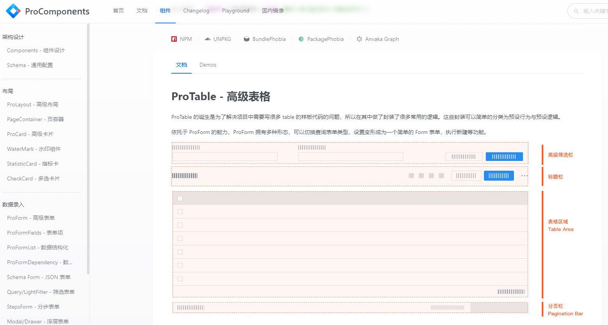
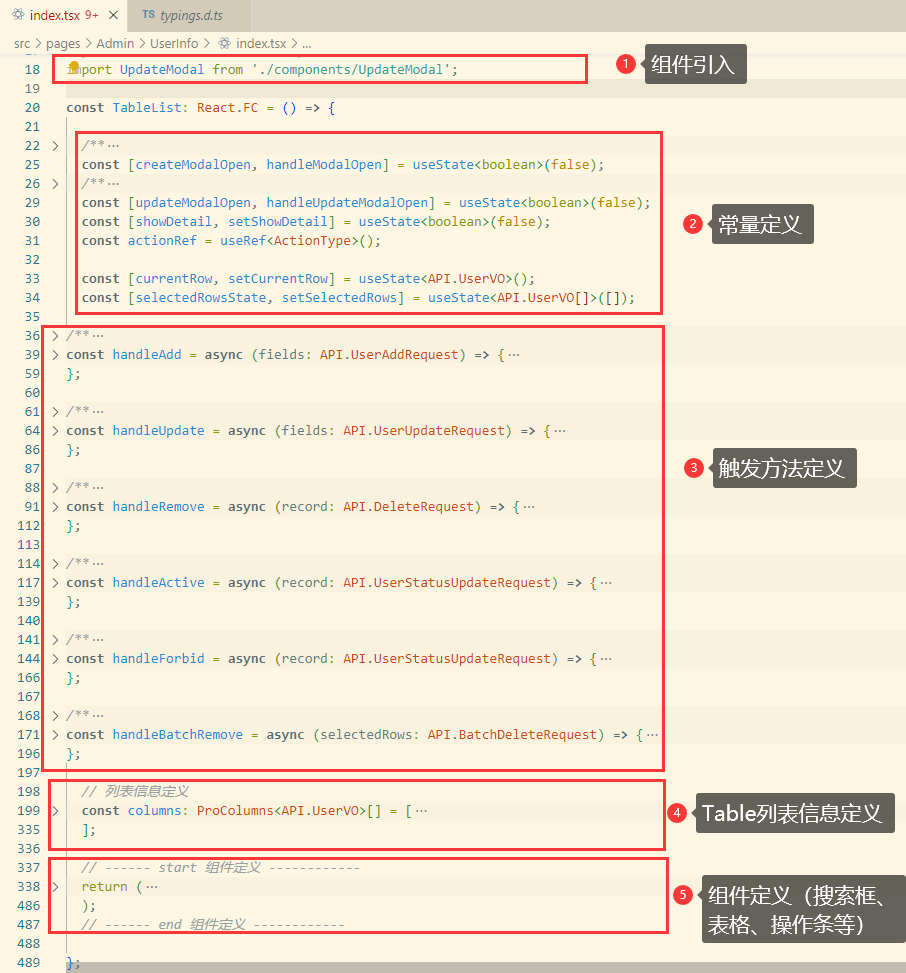
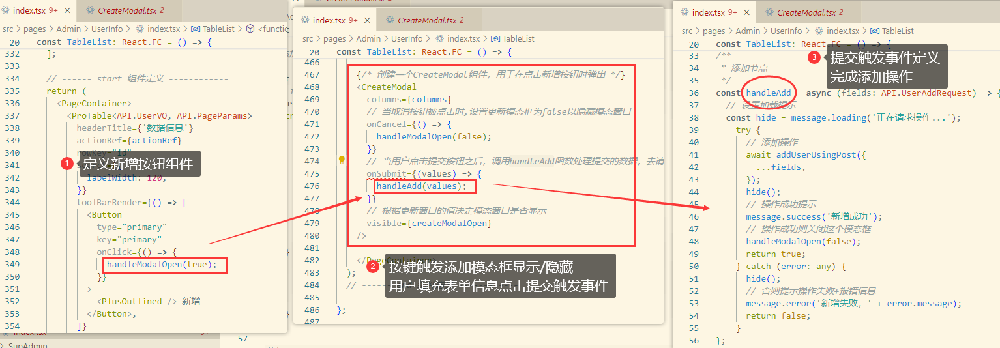
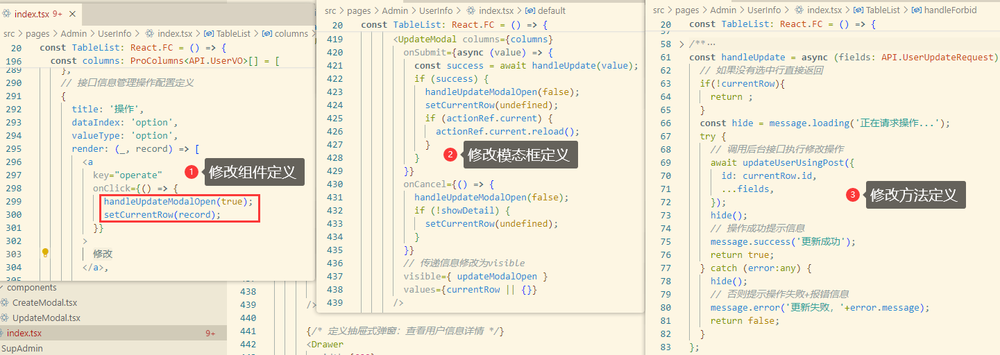
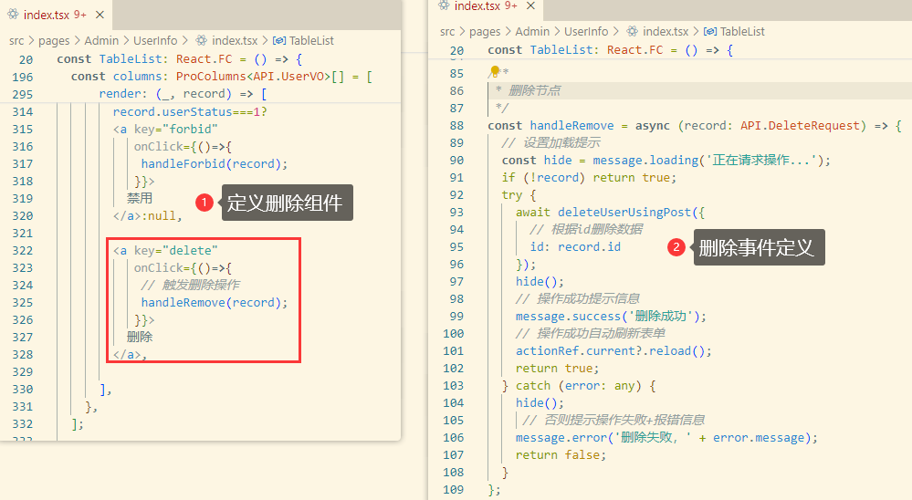
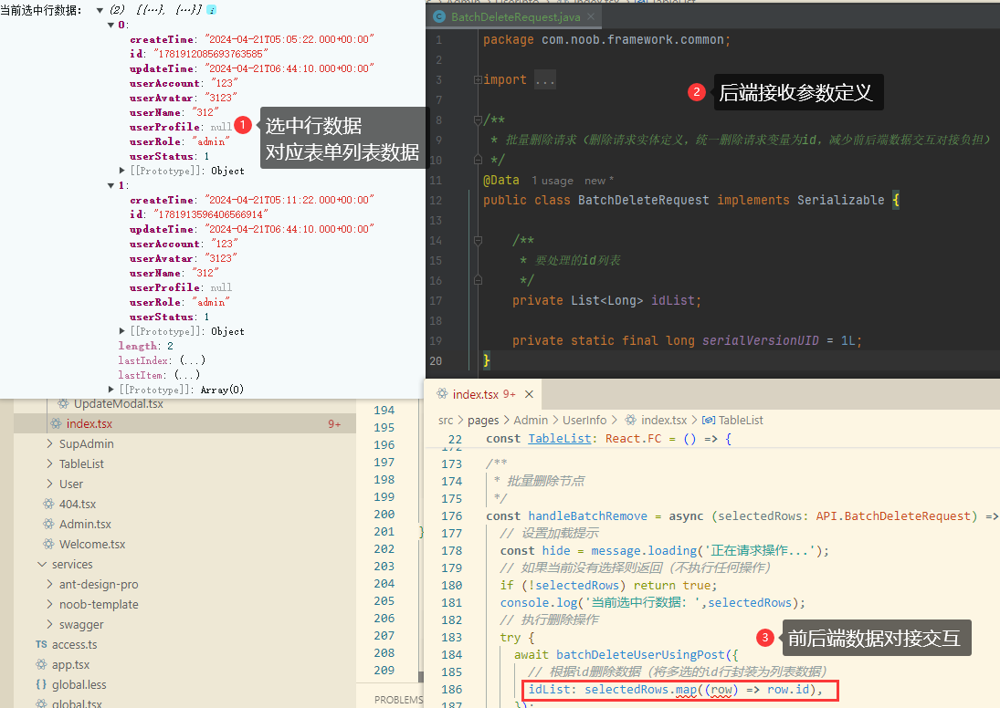
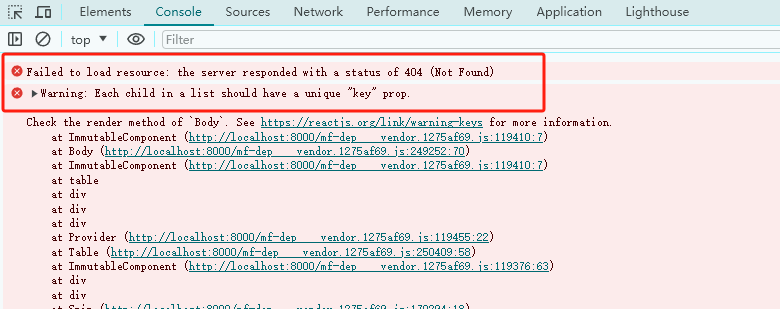

## 用户管理


### 1.用户注销

修改`compontent/RightContent/AvatarDropdown.tsx`内容，搜索loginOut()方法实现，将默认的loginOut方法修改为后端自己的方法（调用后端接口userLogoutUsingPost）

```ts
# 1.引入接口方法
import { userLogoutUsingPost } from '@/services/noob-template/userController';

# 2.修改loginOut()方法调用为userLogoutUsingPost（调用后端接口），并实现页面跳转（登录注销调用后台接口响应成功，随后跳转到登录页面）
const onMenuClick = useCallback(
    (event: MenuInfo) => {
      const { key } = event;
      if (key === 'logout') {
        flushSync(() => {
          setInitialState((s) => ({ ...s, loginUser: undefined }));
        });

        // 调用后台接口实现登录注销
        userLogoutUsingPost();
        // 跳转到登录界面
        const { search, pathname } = window.location;
        const redirect = pathname + search;
        history.replace('/user/login', { redirect })

        return;
      }
      history.push(`/account/${key}`);
    },
    

# 3.删除原有的loginOut()方法

```


​	调整完成，测试登录注销，注销完成跳转到登录页面


### 2.用户注册


### 3.个人信息


### 4.密码修改


### 5.用户信息管理

组件定义：`Admin/UserInfo/index.tsx`

方式1：从一个最干净的页面，一步步引入组件进行构建

方式2：使用ant-design-pro默认提供的TableList样例进行构建

[Ant-Design组件库](https://ant.design/index-cn/)

#### 用户列表

【1】最简单的初始化模板

```tsx
import React from 'react';

const TableList: React.FC = () => {
  return (
    
    // 页面信息定义
    <div className = "table-list">
      hello my list
    </div>
  
  );
};

export default TableList;
```

【2】引入组件（Table）

​	[原生表格组件库](https://ant.design/components/table-cn)、[Pro组件库](https://procomponents.ant.design/components/table)

​	选择Pro组件库，不需要自己单独引入一个组件，只需用其封装的组件构建模板即可




【3】此处参考api-platform中的接口信息管理构建实现（后续按需引入组件丰富系统功能）

​	后端处理逻辑：分页查询所有用户信息，返回UserVO =》 User 通过属性赋值的方式处理字段映射


> 代码思路分析

​	从组件定义、方法触发去跟踪每个实现，首先了解代码的大致框架，然后再去扣实现细节。以列表数据展示为例

​	其中columns的定义和Table列表是相关的，columns中定义的属性和后端响应的数据对应



​	可以理解为组件定义就是HTML封装（定义组件、交互）、colmuns（数据封装），通过这两块的内容定义构建整个页面的交互响应。其中一些模块框、操作触发等则结合相应规则进行调整即可

​	拆解每块的内容，结合前后端交互去理解每个参数的配置，以处理方法为参考（调用后台接口完成交互响应），以handleAdd说明

```tsx
const handleAdd = async (fields: API.UserAddRequest) => {
  	// 业务逻辑处理
    await addUserUsingPost({
        ...fields,
      });
};
```

| 参数                                     | 说明                                                         |
| ---------------------------------------- | ------------------------------------------------------------ |
| `handleAdd`                              | 方法名称                                                     |
| `async`                                  | 异步调用                                                     |
| `fields`                                 | 参数（传入参数），可在方法中使用                             |
| `API.UserAddRequest`                     | 参数类型（与后台交互响应的参数类型，也可以是自定义的参数类型）<br />【1】例如此处调用新增用户接口，传入的UserAddRequest类型参数，直接处理即可<br />【2】如果是自定义参数类型（例如在`typing.d.ts`中定义了一个`API.MineRequest`类型），可用于处理自定义业务逻辑，而不局限在指定内容中 |
| `await addUserUsingPost({  ...fields});` | 请求调用后台接口，完成交互（封装参数进行交互响应，例如此处fields则为方法传递进来的数据） |


​	项目代码中飘红，提示一些参数无法在指定类型中找到，一般都是代码编写规范的问题，例如使用了某个类型定义，但要使用的字段却没有在这个类型中定义，就会飘红提示。可能某些场景下不会影响代码运行，但是就是会显示飘红。一些异常情况也要去关注，排查代码问题

​	❓此处思考一个问题：为什么要约定前后端接口规范（基于OpenAPI），可以从代码接口中看到，通过约定交互规范，可以很清晰的看到前后端接口交互的规则，而不是乱糟糟的自定义，便于在项目中跟踪错误。项目开发中一些为了便捷处理，前后端约定交互传递的参数为一整个JSON大字符串格式，这种格式虽然交互无负担，前后端一定程度上简化了代码编写重复定义、开发复杂度（例如不需要额外定义每个接口的请求定义），但是一旦出错排查则很难去跟踪定位具体的问题和实现细节。

​	而通过约定请求交互格式，可以很快定位排查代码问题，减少前后端交互成本


要引入一个功能项的思路：

【1】创建组件（引入组件定义）：新建按钮=》弹出【新建】模态框=》点击提交触发方法（调用后台）

【2】方法触发（时间触发监听、定义）


#### 新增用户

> 构建思路（掌握构建核心，再去扣实现细节）

【1】ProTable组件中配置toolBarRender，引入一个Button组件，定义onClick监听方法（模态框管理）

【2】CreateModal模态框（作为内置组件引入，通过createModalOpen控制模态框是否可见）

【3】在index.tsx引入模态框，当用户填充完表单点击提交触发onsubmit提交事件调用handleAdd方法





#### 修改用户

类似的，修改用户也是基于模态框实现，其构建思路和【新增用户】大同小异，可能一些细节需要处理




#### 删除用户

> 构建思路

【1】定义删除组件（删除按钮）

【2】按钮触发删除操作方法定义




#### 变更角色（在修改页面中操作）


#### 查看用户

> 构架思路

【1】创建查看信息组件（通过超链接关联）

【2】引入抽屉式弹窗组件，并通过事件触发弹窗


#### 批量操作删除用户

> 构建思路

【1】定义常量设定选择行、设置行

【2】ProTable中配置rowKey（每一行的key定义）、rowSelection（选择器：封装选中行信息）

【3】定义多选操作栏配置：如果选中了多行则显示操作栏（可以理解为多选操作栏触发按钮的条件，也可自动触发事件）

【4】定义批量操作方法（组件触发操作）：封装行数据，然后调用后台接口批量操作

> 代码片段

```tsx
# 1.定义常量设定选择行、设置行
const [currentRow, setCurrentRow] = useState<API.User>();
const [selectedRowsState, setSelectedRows] = useState<API.User[]>([]);

# 2.ProTable中配置rowKey（此处rowKey对应的是唯一键，和设定的columns中的属性定义字段一致，例如此处根据id来组合多选行。如果指定的rowKey不存在，则会出现选中一个却全部被选的情况）
<ProTable<API.UserVO, API.PageParams>
        headerTitle={'查询表格'}
        actionRef={actionRef}
        rowKey="id"
        search={{
          labelWidth: 120,
        }}
        
        # 3.定义多选操作栏配置：如果选中了多行则显示操作栏
        {
        // 如果多选选择，则显示操作栏
        selectedRowsState?.length > 0 && (
        <FooterToolbar
          <Button
            onClick={async () => {
              // 批量操作
              await handleBatchRemove(selectedRowsState);
              // 操作成功清空多选
              setSelectedRows([]);
              // 重置表单
              actionRef.current?.reloadAndRest?.();
            }}
          >
            批量删除
          </Button>
          {/* <Button type="primary">批量操作</Button> */}
        </FooterToolbar>
      )}
            
            
# 4.定义批量操作方法
/**
 * 批量删除节点
 */
const handleBatchRemove = async (selectedRows: API.BatchDeleteRequest) => {
  // 如果当前没有选择则返回（不执行任何操作）
  if (!selectedRows) return true;

  // 执行删除操作
  try {
    await batchDeleteUserUsingPost({
      // 根据id删除数据（将多选的id行封装为列表数据）
      idList: selectedRows.map((row) => row.id),
    });
    ...... 其他业务逻辑处理 .......
    
  } catch (error: any) {
    ...... 其他业务逻辑处理 .......
  }
};
                 
```

> 前后端数据对接

后端定义：`BatchDeleteRequest：List<Long> idList`

前端定义：选中行数据获取的是表单列表数据，需要转化为后端所需格式




> 注意事项

​	rowKey配置：要和自己的业务字段对应，避免选中一行却出现全部选中的情况（这种情况一般就是键值冲突问题），如果列表属性中id作为唯一键，则此处rowKey可以设定为id，但是如果设置了不存在的字段（例如config）则组件把它当做常量处理了，渲染的时候就会出现每一行的rowKey值都相同导致出现上述问题




### 6.完整代码参考

> 用户信息CRUD（inde.tsx）

```tsx
import { PlusOutlined } from '@ant-design/icons';
import type { ActionType, ProColumns, ProDescriptionsItemProps } from '@ant-design/pro-components';
import {
  FooterToolbar,
  PageContainer,
  ProDescriptions,
  ProTable
} from '@ant-design/pro-components';
import '@umijs/max';
import { Button, Drawer, message } from 'antd';
import React, { useRef, useState } from 'react';

// 引入用户信息管理相关API
import { addUserUsingPost, batchDeleteUserUsingPost, deleteUserUsingPost, handleUserStatusUsingPost, listUserVoByPageUsingPost, updateUserUsingPost } from '@/services/noob-template/userController';

// 接入自定义模态框或组件（新增、修改）
import CreateModal from './components/CreateModal';
import UpdateModal from './components/UpdateModal';

const TableList: React.FC = () => {

  // 新增窗口的弹窗
  const [createModalOpen, handleModalOpen] = useState<boolean>(false);
  // 更新窗口的弹窗
  const [updateModalOpen, handleUpdateModalOpen] = useState<boolean>(false);
  // 抽屉式弹窗（查看详情）
  const [showDetail, setShowDetail] = useState<boolean>(false);
  const actionRef = useRef<ActionType>();
  // 单选、多选 
  const [currentRow, setCurrentRow] = useState<API.UserVO>();
  const [selectedRowsState, setSelectedRows] = useState<API.UserVO[]>([]);

/**
 * 添加节点
 */
const handleAdd = async (fields: API.UserAddRequest) => {
  // 设置加载提示
  const hide = message.loading('正在请求操作...');
    try {
      // 添加操作
      await addUserUsingPost({
        ...fields,
      });
      hide();
      // 操作成功提示
      message.success('新增成功');
      // 操作成功则关闭这个模态框
      handleModalOpen(false);
      return true;
    } catch (error: any) {
      hide();
      // 否则提示操作失败+报错信息
      message.error('新增失败，' + error.message);
      return false;
    }
};

/**
 * 更新节点
 */
const handleUpdate = async (fields: API.UserUpdateRequest) => {
  // 如果没有选中行直接返回 
  if(!currentRow){
    return ;
  }
  const hide = message.loading('正在请求操作...');
  try {
    // 调用后台接口执行修改操作
    await updateUserUsingPost({
      id: currentRow.id,
      ...fields,
    });
    hide();
    // 操作成功提示信息
    message.success('更新成功');
    return true;
  } catch (error:any) {
    hide();
    // 否则提示操作失败+报错信息
    message.error('更新失败，'+error.message);
    return false;
  }
};

/**
 * 删除节点
 */
const handleRemove = async (record: API.DeleteRequest) => {
  // 设置加载提示
  const hide = message.loading('正在请求操作...');
  if (!record) return true;
  try {
    await deleteUserUsingPost({
      // 根据id删除数据
      id: record.id
    });
    hide();
    // 操作成功提示信息
    message.success('删除成功');
    // 操作成功自动刷新表单
    actionRef.current?.reload();
    return true;
  } catch (error: any) {
    hide();
     // 否则提示操作失败+报错信息
    message.error('删除失败，' + error.message);
    return false;
  }
};

/**
 * 激活用户
 */
const handleActive = async (record: API.UserStatusUpdateRequest) => {
  // 设置加载中的提示为'正在处理'
  const hide = message.loading('正在处理');
  if (!record) return true;
  try {
     // 调用接口
    await handleUserStatusUsingPost({
      id: record.id,
      operType: 'active'
    });
    hide();
    // 如果调用成功会提示'处理成功'
    message.success('激活成功');
    // 处理成功自动刷新表单
    actionRef.current?.reload();
    return true;
  } catch (error: any) {
    hide();
     // 否则提示操作失败+报错信息
    message.error('激活失败，' + error.message);
    return false;
  }
};

/**
 * 禁用用户
 */
const handleForbid = async (record: API.UserStatusUpdateRequest) => {
  // 设置加载中的提示为'正在处理'
  const hide = message.loading('正在处理');
  if (!record) return true;
  try {
     // 调用接口
    await handleUserStatusUsingPost({
      id: record.id,
      operType: 'forbid'
    });
    hide();
    // 如果调用成功会提示'处理成功'
    message.success('禁用成功');
    // 处理成功自动刷新表单
    actionRef.current?.reload();
    return true;
  } catch (error: any) {
    hide();
     // 否则提示操作失败+报错信息
    message.error('禁用失败，' + error.message);
    return false;
  }
};

/**
 * 批量删除节点
 */
const handleBatchRemove = async (selectedRows: API.BatchDeleteRequest) => {
  // 设置加载提示
  const hide = message.loading('正在请求操作...');
  // 如果当前没有选择则返回（不执行任何操作）
  if (!selectedRows) return true;
  console.log('当前选中行数据：',selectedRows);
  // 执行删除操作
  try {
    await batchDeleteUserUsingPost({
      // 根据id删除数据（将多选的id行封装为列表数据）
      idList: selectedRows.map((row) => row.id),
    });

    hide();
    // 操作成功提示信息
    message.success('删除成功');
    // 操作成功自动刷新表单
    actionRef.current?.reload();
    return true;
  } catch (error: any) {
    hide();
     // 否则提示操作失败+报错信息
    message.error('删除失败，' + error.message);
    return false;
  }
};

  // 列表信息定义
  const columns: ProColumns<API.UserVO>[] = [
    {
      title: '用户id',
      dataIndex: 'id',
      valueType:'index',
      // tip: 'The rule name is the unique key',
      render: (dom, entity) => {
        return (
          <a
            onClick={() => {
              setCurrentRow(entity);
              setShowDetail(true);
            }}
          >
            {dom}
          </a>
        );
      },
    },
    {
      title: '用户账号',
      dataIndex: 'userAccount',
      valueType: 'text',
      formItemProps:{
        rules:[{
          required:true, // 设置必填项
          message:"请输入", // 设置提示信息
        }]
      }
    },
    {
      title: '用户名',
      dataIndex: 'userName',
      valueType: 'text',
      formItemProps:{
        rules:[{
          required:true, // 设置必填项
          message:"请输入", // 设置提示信息
        }]
      }
    },
    {
      title: '头像',
      dataIndex: 'userAvatar',
      // valueType: 'text',
      valueType: 'image', // 图片格式
      formItemProps:{},
      hideInSearch: true, // 在搜索组件中隐藏
    },
    // 下拉框（用户角色：user、admin）
    {
      title: '用户角色',
      dataIndex: 'userRole',
      valueType: 'text',
      formItemProps:{},
      valueEnum: {
        'user': {
          text: '普通用户',
        },
        'admin': {
          text: '管理员',
        },
      },
    },
    {
      title: '用户状态',
      dataIndex: 'userStatus',
      valueEnum: {
        0: {
          text: '禁用',
          status: 'Default',
        },
        1: {
          text: '开启',
          status: 'Processing',
        },
      },
      hideInForm: true
    },
    {
      title: '创建时间',
      dataIndex: 'createTime',
      valueType: 'dateTime',
      hideInForm:true, // 在表单组件中隐藏
      hideInSearch: true, // 在搜索组件中隐藏
      hidden: false
    },
    {
      title: '更新时间',
      dataIndex: 'updateTime',
      valueType: 'dateTime',
      hideInForm:true, // 在表单组件中隐藏
      hideInSearch: true, // 在搜索组件中隐藏
    },
    // 接口信息管理操作配置定义
    {
      title: '操作',
      dataIndex: 'option',
      valueType: 'option',
      render: (_, record) => [
        <a
          key="operate"
          onClick={() => {
            handleUpdateModalOpen(true);
            setCurrentRow(record);
          }}
        >
          修改
        </a>,

        record.userStatus===0?
        <a key="active" 
           onClick={()=>{
            handleActive(record);
           }}>
          激活
        </a>:null,

        record.userStatus===1?
        <a key="forbid" 
           onClick={()=>{
            handleForbid(record);
           }}>
          禁用
        </a>:null,

        <a key="delete" 
           onClick={()=>{
            // 触发删除操作
            handleRemove(record);
           }}>
          删除
        </a>,
        
      ],
    },
  ];

  // ------ start 组件定义 ------------
  return (
    <PageContainer>
      <ProTable<API.UserVO, API.PageParams>
        headerTitle={'数据信息'}
        actionRef={actionRef}
        rowKey="id"
        search={{
          labelWidth: 120,
        }}
        toolBarRender={() => [
          <Button
            type="primary"
            key="primary"
            onClick={() => {
              handleModalOpen(true);
            }}
          >
            <PlusOutlined /> 新增
          </Button>,
        ]}
        // 原脚手架默认调用API接口 request={rule}；request={listInterfaceInfoByPageUsingPost}直接调用的话无法渲染，因为响应数据交互不匹配

        // 根据request规则，重新编写请求和响应处理
        request={async (params, sort: Record<string, SortOrder>, filter: Record<string, React.ReactText[] | null>) => {
          const res = await listUserVoByPageUsingPost({
            ...params
          })
          if (res?.data) {
            return  {
              data: res?.data.records || [],
              success: true,
              total: res.total,
            }
          }
        }}
        
        // 列属性定义
        columns={columns}
        rowSelection={{
          onChange: (_, selectedRows) => {
            setSelectedRows(selectedRows);
          },
        }}
      />
      
      {
        // 如果多选选择，则显示操作栏
        selectedRowsState?.length > 0 && (
        <FooterToolbar
          extra={
            <div>
              已选择{' '}
              <a
                style={{
                  fontWeight: 600,
                }}
              >
                {selectedRowsState.length}
              </a>{' '}
              项 &nbsp;&nbsp;
              <span>
                {/* 共 {selectedRowsState.reduce((pre, item) => pre + item.callNo!, 0)} 万 */}
                共 {selectedRowsState.length} 项
              </span>
            </div>
          }
        >
          <Button
            onClick={async () => {
              // 批量操作
              await handleBatchRemove(selectedRowsState);
              // 操作成功清空多选
              setSelectedRows([]);
              // 重置表单
              actionRef.current?.reloadAndRest?.();
            }}
          >
            批量删除
          </Button>
          {/* <Button type="primary">批量操作</Button> */}
        </FooterToolbar>
      )}

      <UpdateModal columns={columns}
        onSubmit={async (value) => {
          const success = await handleUpdate(value);
          if (success) {
            handleUpdateModalOpen(false);
            setCurrentRow(undefined);
            if (actionRef.current) {
              actionRef.current.reload();
            }
          }
        }}
        onCancel={() => {
          handleUpdateModalOpen(false);
          if (!showDetail) {
            setCurrentRow(undefined);
          }
        }}
        // 传递信息修改为visible
        visible={ updateModalOpen }
        values={currentRow || {}}
      />

      {/* 定义抽屉式弹窗：查看用户信息详情 */}
      <Drawer
        width={600}
        open={showDetail}
        onClose={() => {
          setCurrentRow(undefined);
          setShowDetail(false);
        }}
        closable={false}
      >
        {currentRow?.userAccount && (
          <ProDescriptions<API.UserVO>
            column={2}
            title={currentRow?.userAccount}
            request={async () => ({
              data: currentRow || {},
            })}
            params={{
              id: currentRow?.id,
            }}
            columns={columns as ProDescriptionsItemProps<API.UserVO>[]}
          />
        )}
      </Drawer>


    {/* 创建一个CreateModal组件，用于在点击新增按钮时弹出 */}
    <CreateModal
      columns={columns}
      // 当取消按钮被点击时,设置更新模态框为false以隐藏模态窗口
      onCancel={() => {
        handleModalOpen(false);
      }}
      // 当用户点击提交按钮之后，调用handleAdd函数处理提交的数据，去请求后端添加数据(这里的报错不用管,可能里面组件的属性和外层的不一致)
      onSubmit={(values) => {
        handleAdd(values);
      }}
      // 根据更新窗口的值决定模态窗口是否显示
      visible={createModalOpen}
    />

    </PageContainer>
  );
  // ------ end 组件定义 ------------

};

export default TableList;
```

> compontents/CreateModal.tsx

```tsx
import type { ProColumns } from '@ant-design/pro-components';
import { ProTable } from '@ant-design/pro-components';
import '@umijs/max';
import { Modal } from 'antd';
import React from 'react';

export type Props = {
  columns: ProColumns<API.UserAddRequest>[];
  // 当用户点击取消按钮时触发
  onCancel: () => void;
  // 当用户提交表单时,将用户输入的数据作为参数传递给后台
  onSubmit: (values: API.UserAddRequest) => Promise<void>;
  // 模态框是否可见
  visible: boolean;
  // values不用传递
  // values: Partial<API.RuleListItem>;
};

const CreateModal: React.FC<Props> = (props) => {
  // 使用解构赋值获取props中的属性
  const { visible, columns, onCancel, onSubmit } = props;

  return (
    // 创建一个Modal组件,通过visible属性控制其显示或隐藏,footer设置为null把表单项的'取消'和'确认'按钮去掉
    <Modal visible={visible} footer={null} onCancel={() => onCancel?.()}>
     {/* 创建一个ProTable组件,设定它为表单类型,通过columns属性设置表格的列，提交表单时调用onSubmit函数 */}
      <ProTable
        type="form"
        columns={columns}
        onSubmit={async (value) => {
          onSubmit?.(value);
        }}
      />
    </Modal>
  );
};
export default CreateModal;
```

> compontents/UpdateModal.tsx

```tsx
import type { ProColumns, ProFormInstance } from '@ant-design/pro-components';
import { ProTable } from '@ant-design/pro-components';
import '@umijs/max';
import { Modal } from 'antd';
import React, { useEffect, useRef } from 'react';

// 定义组件的属性类型
export type Props = {
  // 表单中需要编辑的数据
  values: API.UserUpdateRequest;
  // 表格的列定义
  columns: ProColumns<API.UserUpdateRequest>[];
  // 当用户点击取消按钮时触发
  onCancel: () => void;
  // 当用户提交表单时,将用户输入的数据作为参数传递给后台
  onSubmit: (values: API.UserUpdateRequest) => Promise<void>;
  // 控制模态框是否可见
  visible: boolean;
};

// 定义更新模态框组件
const UpdateModal: React.FC<Props> = (props) => {
  // 从props中获取属性
  const { values, visible, columns, onCancel, onSubmit } = props;

  // 使用React的useRef创建一个引用，以访问ProTable中的表单实例
  const formRef = useRef<ProFormInstance>();

  // 防止修改的表单内容一直是同一个内容,要监听values的变化
  // 使用React的useEffect在值改变时更新表单的值
  useEffect(() => {
    if (formRef) {
      formRef.current?.setFieldsValue(values);
    }
  }, [values]);
  
  // 返回模态框组件
  return (
     // 创建一个Modal组件,通过visible属性控制其显示或隐藏,footer设置为null把表单项的'取消'和'确认'按钮去掉
    <Modal visible={visible} footer={null} onCancel={() => onCancel?.()}>
      {/* 创建一个ProTable组件,设定它为表单类型,将表单实例绑定到ref,通过columns属性设置表格的列，提交表单时调用onSubmit函数 */}
      <ProTable
        type="form"
        formRef={formRef}
        columns={columns}
        onSubmit={async (value) => {
          onSubmit?.(value);
        }}
      />
    </Modal>
  );
};
export default UpdateModal;
```

