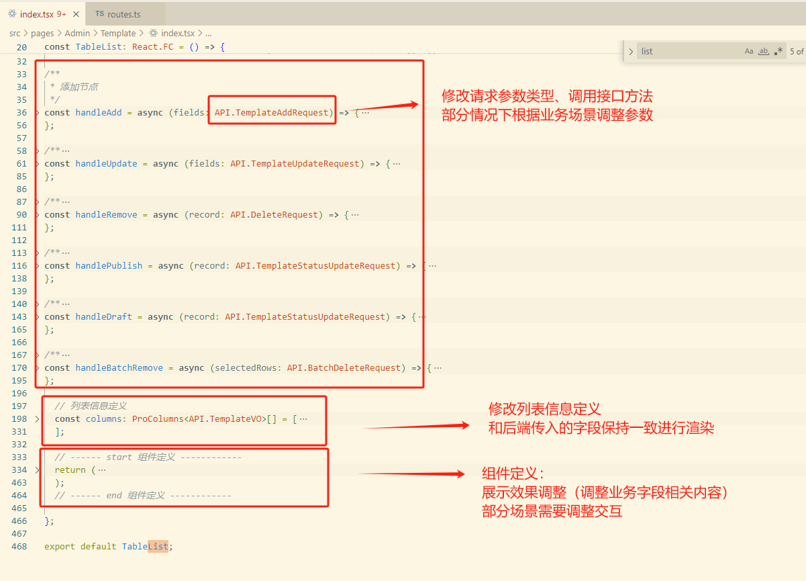

# 模板管理


> 数据表构建

```java
DROP TABLE IF EXISTS `template`;
CREATE TABLE `template` (
  `id` bigint(20) NOT NULL COMMENT 'id',
  `templateName` varchar(512) DEFAULT NULL COMMENT '模板名称',
  `templateContent` text COMMENT '模板内容',
  `creater` bigint(20) DEFAULT NULL COMMENT '创建者',
  `updater` bigint(20) DEFAULT NULL COMMENT '修改者',
  `createTime` datetime DEFAULT NULL COMMENT '创建时间',
  `updateTime` datetime DEFAULT NULL COMMENT '修改时间',
  `isDelete` tinyint(4) DEFAULT '0' COMMENT '是否删除（0-未删除；1-已删除）',
  `status` tinyint(4) DEFAULT NULL COMMENT '模板状态（0-禁用；1-激活）',
  PRIMARY KEY (`id`)
) ENGINE=InnoDB DEFAULT CHARSET=utf8;
```

 


## 构建步骤说明

> 构建步骤说明

【1】数据表创建

【2】借助MyBatisX插件生成代码，对号入座

【3】构建controller，启动接口测试

【4】前端模块构建


### 1.数据表创建

```

```


### 2.借助MyBatisX插件生成代码，对号入座


在Database模块中选中表，随后右键选择MyBatisX-Generator


​	代码生成成功在src/main/java/generator文件夹下可跟踪生成的代码，将代码对号入座即可

| generator             | com.noob.springbootinit |
| --------------------- | ----------------------- |
| domain                | model/entity            |
| mapper                | mapper                  |
| service、service/impl | service、service/impl   |
| resources/mapper      | 调整对应实体映射        |


> 实体类调整

**主键ID**：`@TableId(type = IdType.AUTO)`调整为`@TableId(type = IdType.ASSIGN_ID)`（将原有自动递增序列调整为雪花算法生成唯一id，长整型）

**逻辑删除**：isDelete字段加上逻辑删除注解`@TableLogic`（逻辑删除字段）


> 飘红报错调整（todo）

​	对于一些项目中暂时没有引入的内容可以先清理掉，例如第三方登录：UserService中的第三方登录接口（userLoginByMpOpen）、UserController中的userLoginByWxOpen、附带删除controller/WxMpController、wxmp文件夹（微信公众号接入相关）


> 重启项目测试

​	用户注册=》用户登录，测试接口


### 3.构建controller，启动接口测试


controller层、dto层等内容

基于原有PostController进行改造，然后依次引入相关DTO定义等内容

【1】复制PostController为TemplateController（将Post统一调整为Template，注意大小写相关也要分别替换），注意全局替换一些关键字处理，不要搞错了

【2】注释调整：帖子=》模板

【3】根据飘红依次引入相关的实体定义

​	参考上述内容，在model/dto下创建chart包，将原有post下相关的xxxRequest复制过来修改为对应的TemplateXXXRequest，然后再依次根据实际业务场景调整请求参数（先构建基础框架，再调整业务字段细节）

​	类似地，在model/vo下创建TemplateVO（从PostVO中构建），将字段定义替换为Template中的内容


​	TemplateController的addTemplate改造，设置要添加的Chart实体值（可用快捷键ALT+ENTER生成setter）然后结合ChartAddRequest看哪些是前端传递过来的，哪些是需要手动赋值的内容，填充即可。此外需要清理掉一些无关紧要的接口定义


【4】Service相关改造（参考PostService实现）

​	先把项目飘红报错处理，搭建基础业务模块框架，然后再定位具体的业务实现


> 需要注意的点

【1】ID主键生成策略：`@TableId(type = IdType.AUTO)`调整为`@TableId(type = IdType.ASSIGN_ID)`（将原有自动递增序列调整为雪花算法生成唯一id，长整型）

【2】逻辑删除（检验逻辑删除是否生效）：新增template逻辑删除失效问题定位关注的是删除操作，而不是新增；新增数据需要默认设定isDelete字段为0（可以在数据库中设置，也可以代码设定），mybatis并不会新增操作自动设定isDelete的值，只会在删除操作的时候校验isDelete并修改，**不要混淆概念误认为新增会自动设定，而陷入全局逻辑删除配置部分不生效的误区**。排查数据库可以发现数据表设计默认为isDelete设定的默认值为0

【3】接口文档生成（如果是额外构建模块，需要检查项目包路径配置api-rule-resources，将关联的controller引入到配置中），如果前端生成api接口失败则通过后台访问确认接口文档是否有相应的controller，如果没有则需定位配置检查


### 4.前端模块构建

​	（前面已经完成前后端联调，此处只需要执行指令生成接口交互即可）

​	打开package.json，执行openapi指令，生成swagger文件（在services目录多出一个noob-template目录，里面自动生成调用后端指定接口的方法代码）（终端输入`yarn run openapi`）


​	参考现有模块实现完成构建即可：

【1】生成接口服务

【2】routes.ts路由配置组件

【3】管理模块：引入现有的模板进行构建




