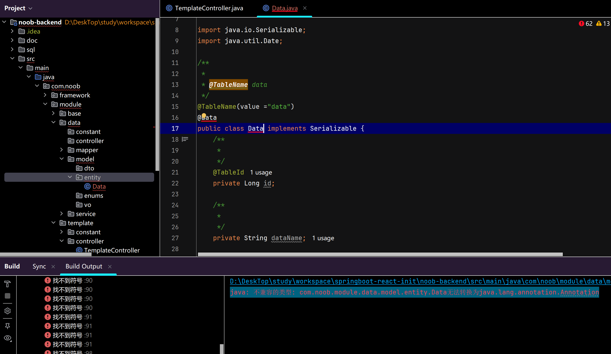
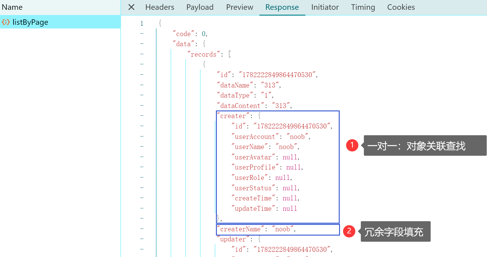

# 数据管理


> 数据表构建

```sql
CREATE TABLE `data_info` (
  `id` bigint(20) NOT NULL COMMENT 'id',
  `dataName` varchar(512) CHARACTER SET utf8 DEFAULT NULL COMMENT '数据名称',
  `dataType` varchar(512) CHARACTER SET utf8 DEFAULT NULL COMMENT '数据类型',
  `dataContent` text CHARACTER SET utf8 COMMENT '数据内容',
  `creater` bigint(20) DEFAULT NULL COMMENT '创建者',
  `updater` bigint(20) DEFAULT NULL COMMENT '修改者',
  `status` tinyint(4) DEFAULT NULL COMMENT '数据状态(0-暂存；1-发布）',
  `isDelete` tinyint(4) DEFAULT '0' COMMENT '删除状态（0-未删除；1-已删除）',
  `createTime` datetime DEFAULT NULL COMMENT '创建时间',
  `updateTime` datetime DEFAULT NULL COMMENT '修改时间',
  PRIMARY KEY (`id`)
) ENGINE=InnoDB DEFAULT CHARSET=utf8mb4;
```

 


## 构建步骤说明

> 构建步骤说明

【1】数据表创建

【2】借助MyBatisX插件生成代码，对号入座

【3】构建controller，启动接口测试

【4】前端模块构建


（PS：数据操作层处理，调整为自定义SQL：动态拼接参数完成分页查询逻辑操作）


> 常见开发问题处理


Lambok 注解飘红：

检查Lambok依赖是否正常构建；

检查Lambok在idea中的配置是否正常

检查idea中的注解启动器是否正常配置


原项目不受影响，发现引入构建Data模块之后出现这个问题，Lambok扫描解析转化出错，原因是实体定义了一个名为Data的实体类（可能冲突导致），调整为其他名称后正常处理（和@Data重名）




### 自定义SQL构建分页

#### 构建思路参考

> 参考demo实例
> mybatisplus一对一关联查询

在MyBatis-Plus中，一对一关联查询通常通过实现两个实体类之间的关联映射来完成。以下是一个简单的例子：

假设有两个实体类，一个是`User`和另一个是`UserProfile`，它们之间是一对一的关系。

首先，在`User`实体类中定义一个`UserProfile`的引用：

```java
public class User {
    private Long id;
    private String username;
    // 其他字段...
    
    private UserProfile userProfile; // 一对一关联
 
    // getters and setters...
}
```

然后，在`UserProfile`实体类中定义关联到`User`的外键：

```java
public class UserProfile {
    private Long id;
    private Long userId;
    private String email;
    private String phone;
    // 其他字段...
 
    // getters and setters...
}
```

在上面的映射文件中，`selectUserWithProfile`是一个查询方法，它通过左连接查询用户以及用户的配置文件信息。`userProfileResultMap`定义了如何将查询结果映射到`User`和`UserProfile`实体类。

最后，在你的服务层或者控制器中，你可以调用这个映射的方法来执行关联查询：

```java
@Autowired
private UserMapper userMapper;
 
public User selectUserWithProfile(Long userId) {
    return userMapper.selectUserWithProfile(userId);
}
```

这样，当你调用`selectUserWithProfile`方法时，MyBatis-Plus会执行定义好的SQL语句，并且自动将结果映射到User对象中，其中包含了关联的UserProfile对象。


构建分页查询条件

```sql
<select id="selectUser" resultType="User">
    SELECT * FROM user
    WHERE 1=1
    <if test="username != null and username != ''">
        AND username = #{username}
    </if>
    <if test="email != null and email != ''">
        AND email = #{email}
    </if>
</select>
```

#### 构建实现

> 参考分页构建

controller：

```java
/**
     * 分页获取列表（自定义SQL处理）
     *
     * @param dataInfoQueryRequest
     * @param request
     * @return
     */
    @PostMapping("/listByPage")
    public BaseResponse<Page<DataInfoVO>> listByPage(@RequestBody DataInfoQueryRequest dataInfoQueryRequest,
                                                               HttpServletRequest request) {
        // 获取分页信息
        return ResultUtils.success(dataInfoService.getVOByPage(dataInfoQueryRequest));
    }

```


service：

```java
 /**
     * 分页获取数据封装(SQL处理)
     *
     * @param dataInfoQueryRequest
     * @return
     */
    Page<DataInfoVO> getVOByPage(DataInfoQueryRequest dataInfoQueryRequest);

```

```java
@Override
    public Page<DataInfoVO> getVOByPage(DataInfoQueryRequest dataInfoQueryRequest) {
        long current = dataInfoQueryRequest.getCurrent();
        long size = dataInfoQueryRequest.getPageSize();
        Page<T> page = new Page<>(current, size);
        Page<DataInfoVO> dataInfoVOPage = dataInfoMapper.getVOByPage(dataInfoQueryRequest,page);
        return dataInfoVOPage;
    }
```

mapper：

```java
 // 分页查找数据
    Page<DataInfoVO> getVOByPage(@Param("params") DataInfoQueryRequest dataInfoQueryRequest, Page<T> page);

```

```java
<!-- 映射关系定义 -->
    <resultMap id="getVO" type="com.noob.module.dataInfo.model.vo.DataInfoVO">
        <id property="id" column="id" jdbcType="BIGINT"/>
        <result property="dataName" column="dataName" jdbcType="VARCHAR"/>
        <result property="dataType" column="dataType" jdbcType="VARCHAR"/>
        <result property="dataContent" column="dataContent" jdbcType="VARCHAR"/>
        <result property="status" column="status" jdbcType="TINYINT"/>
        <result property="isDelete" column="isDelete" jdbcType="TINYINT"/>
        <result property="createTime" column="createTime" jdbcType="TIMESTAMP"/>
        <result property="updateTime" column="updateTime" jdbcType="TIMESTAMP"/>
        <!-- 其他字段映射... -->

        <!-- 关联外键映射(一对一)：creater -->
        <association property="creater" javaType="com.noob.module.base.model.vo.UserVO">
            <id property="id" column="id"/>
            <result property="userName" column="createrUserName"/>
            <result property="userAccount" column="createrUserAccount"/>
            <!-- 其他字段映射定义 -->
        </association>

        <!-- 关联外键映射(一对一)：updater -->
        <association property="updater" javaType="com.noob.module.base.model.vo.UserVO">
            <id property="id" column="id"/>
            <result property="userName" column="updaterUserName"/>
            <result property="userAccount" column="updaterUserAccount"/>
            <!-- 其他字段映射定义 -->
        </association>

    </resultMap>

    <!-- 分页获取数据 -->
    <select id="getVOByPage" resultMap="getVO" parameterType="com.noob.module.dataInfo.model.dto.DataInfoQueryRequest">
        SELECT
            di.id,
            di.dataName,
            di.dataType,
            di.dataContent,
            di.creater,
            di.updater,
            di.status,
            di.isDelete,
            di.createTime,
            di.updateTime,
            cu.userName "createrUserName" ,
            cu.userAccount "createrUserAccount",
            uu.userName "updaterUserName",
            uu.userAccount "updaterUserAccount"
        FROM
            data_info di
                LEFT JOIN `user` cu ON cu.id = di.creater
                LEFT JOIN `user` uu ON uu.id = di.updater
        where 1=1
        <!-- 条件数据封装 -->
        <if test="params.dataName !=null and  params.dataName != ''">
            and di.dataName like concat('%',#{params.dataName},'%')
        </if>
        <if test="params.dataType !=null and  params.dataType != ''">
            and di.dataType = #{params.dataType}
        </if>
        <if test="params.dataContent !=null and  params.dataContent != ''">
            and di.dataContent like concat('%',#{params.dataContent},'%')
        </if>
        <if test="params.status !=null and  params.status != ''">
            and di.status = #{params.status}
        </if>
    </select>
```

​	基于这种方式可以从controller、service、mapper（对应sql配置）构建分页查找，此处设定的是一对一关系（数据信息关联创建者、修改者）

​	还有一种方式可以不用配置一对一，即将DataInfoVO中的对象creater（UserVO对象）、updater（UserVO对象）调整为字段冗余到DataInfo中，则只需要配置一个resultMap将sql语句查找出来的字段定义和map定义对应即可完成封装

​	例如DataInfoVO中冗余字段createrName、createrAccount（类似地updaterName、updaterAccount），在Map中定义封装（此处以createrName为参考）。则可在上面的基础上补充一个字段映射定义，然后再在sql中对应填充该字段，简化后的代码实现参考如下所示

```sql
<resultMap id="getVO" type="com.noob.module.dataInfo.model.vo.DataInfoVO">
				---------------- 其他字段 ----------------

        <!-- 冗余字段createrName：对应列名为createrName -->
        <result property="createrName" column="createrName" jdbcType="VARCHAR"/>

        <!-- 关联外键映射(一对一)：creater -->
        <association property="creater" javaType="com.noob.module.base.model.vo.UserVO">
            <id property="id" column="id"/>
            <result property="userName" column="createrUserName"/>
            <result property="userAccount" column="createrUserAccount"/>
            <!-- 其他字段映射定义 -->
        </association>
    </resultMap>

    <!-- 分页获取数据 -->
    <select id="getVOByPage" resultMap="getVO" parameterType="com.noob.module.dataInfo.model.dto.DataInfoQueryRequest">
        SELECT
        		---- 其他字段 -----
            cu.userName "createrName" ,
            cu.userName "createrUserName" ,
            cu.userAccount "createrUserAccount",
        FROM
            data_info di
                LEFT JOIN `user` cu ON cu.id = di.creater
                LEFT JOIN `user` uu ON uu.id = di.updater
        where 1=1
        <!-- 条件数据封装 -->
    </select>
```

​	对照前端响应数据参考



​	基于上述内容，后续复杂sql封装可以不依托于QueryWrapper构建，直接自定义SQL动态拼接参数，基于这种形式可以更好地复杂查询进行跟踪和管理，多练习一些复杂SQL编辑逻辑

​	除却上述基础的一些语句构建，MyBatis还提供了一系列标签支持范围搜索等内容，按照实际业务需求场景调整即可