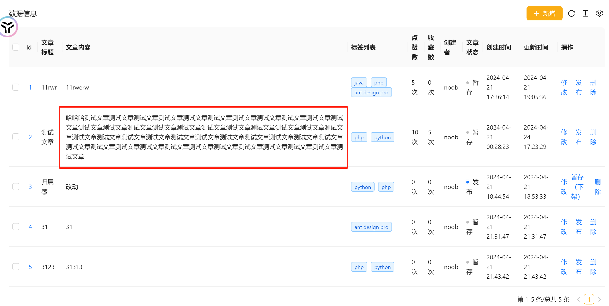
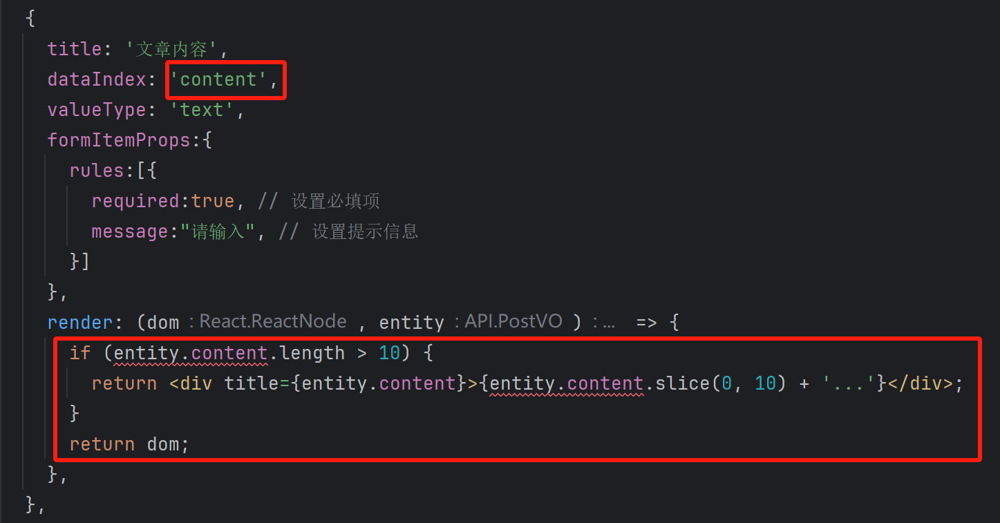
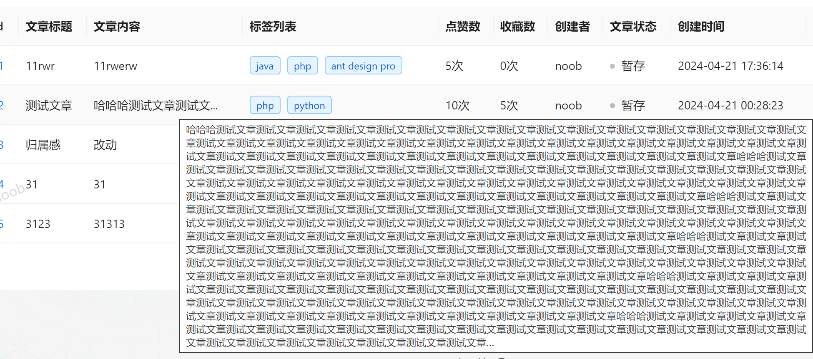
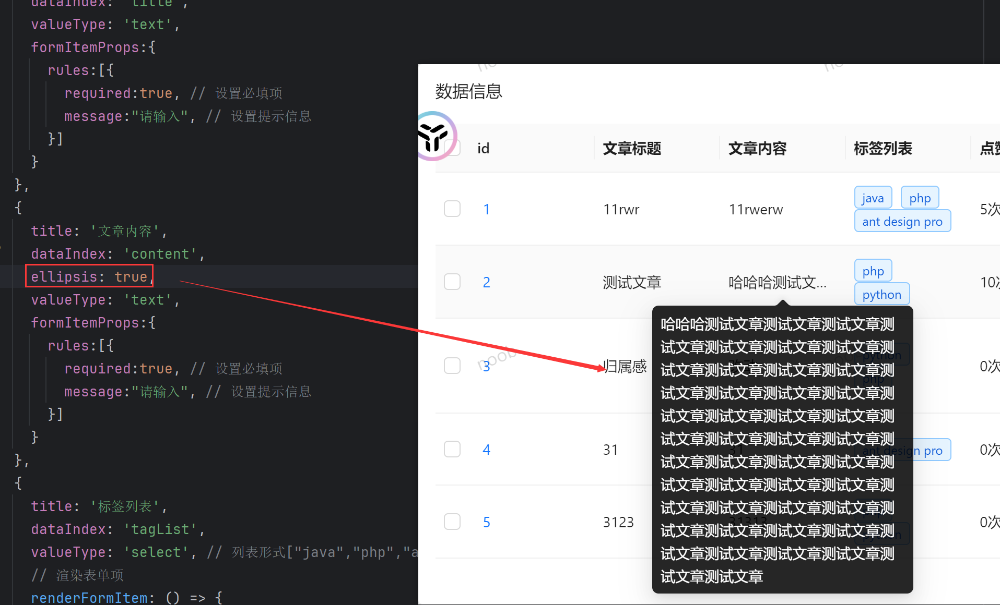

# 常见问题解决

#### 【1】ProTable解决表格内容过长的问题

某些场景下，接口数据都是后端返回的，需要调整文本内容过长往下掉的问题



> 方式1（😎）：使用 `columns` 的 `render` 方法自定义内容的渲染，可以在里面加入省略等样式来控制内容长度

```tsx
const columns: ProColumns[] = [
  {
    title: '长文本',
    dataIndex: 'longText',
    render: (dom, entity) => {
      if (entity.longText.length > 10) {
        return <div title={entity.longText}>{entity.longText.slice(0, 10) + '...'}</div>;
      }
      return dom;
    },
  },
  // ...其他列
];
```





> 方式2：使用 `scroll` 属性设置表格的滚动区域，如设置 `x` 为 `true` 开启水平滚动，可以控制表格的宽度

```tsx
<ProTable
  scroll={{ x: true }}
  // ...其他属性
/>
```

​	可能需要结合样式文件使用（参考文章：[表格内容自适应](https://blog.csdn.net/muge1161105403/article/details/127423488)）

> 方式3：使用 `tooltip` 属性设置为 `true`，可以让过长的文本自动显示为 Tooltip 的形式

```tsx
<ProTable
  columns={[
    {
      title: '长文本',
      dataIndex: 'longText',
      tooltip: true,
    },
    // ...其他列
  ]}
  // ...其他属性
/>
```

> 方式4（😎）：使用 `ellipsis` 属性设置为 `true`，可以让单元格内容过长时自动省略，并且显示为 Tooltip

```tsx
<ProTable
  columns={[
    {
      title: '长文本',
      dataIndex: 'longText',
      ellipsis: true,
    },
    // ...其他列
  ]}
  // ...其他属性
/>
```



#### 【2】水印怎么加？

​	在app.tsx中RunTimeLayoutConfig下有一个waterMarkProps配置，设置水印内容（content）：当前用户名或者账号即可（需要设定为当前可以拿到的用户信息，否则数据为空水印不会生效）

```tsx
	  waterMarkProps: {
      content: initialState?.currentUser?.userName,
    },
```

